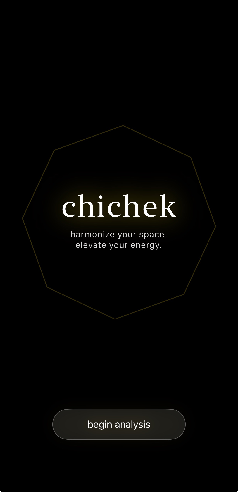
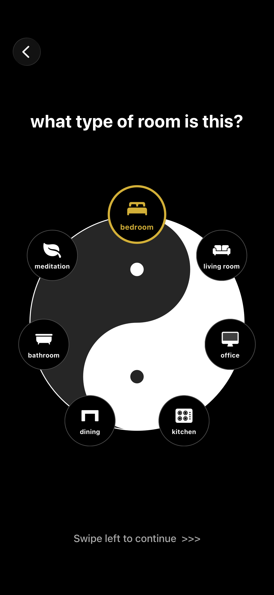
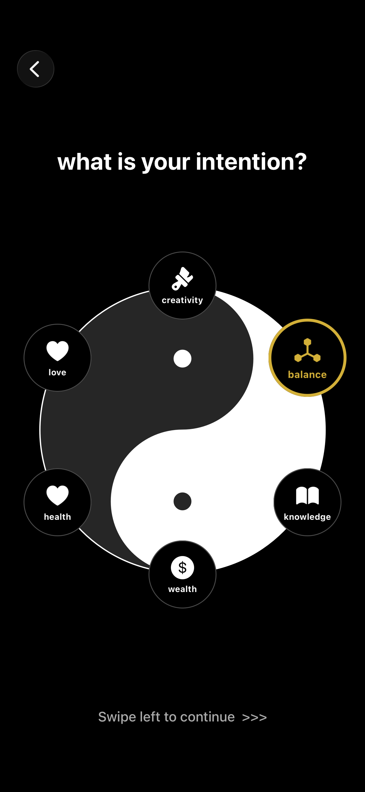
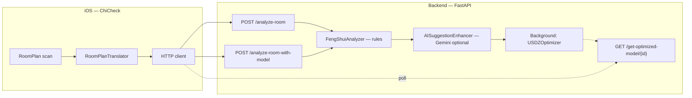

# Feng Shui Analysis App

Hackathon project built at nwHacks 2026, combining Apple RoomPlan, FastAPI, and optional AI-powered layout feedback to analyze room layouts and generate Feng Shui recommendations.

---

## Screenshots

| | |
|---|---|
| **Home** : app entry point | **Room type** : user selects bedroom, office, etc. |
|  |  |

| |
|---|
| **Feng Shui intention** : user picks a Bagua focus (wealth, health, career, etc.) |
|  |

---

## My Contribution
- Designed backend API endpoints using FastAPI
- Built typed request/response validation with Pydantic
- Implemented deterministic Feng Shui scoring logic
- Implemented adjustment suggestions powered by Gemini API
- Added file validation and asynchronous processing for .usdz model uploads


## Tech Stack
- Python
- FastAPI
- Pydantic
- Swift
- RoomPlan
- RealityKit
- Gemini API (optional)


## Key Features
- Converts room scans into structured layout data
- Scores layouts using deterministic Feng Shui rules
- Generates actionable placement suggestions
- Supports optional AI-enhanced recommendation text
- Handles asynchronous 3D model optimization workflows


## Architecture



- **Rule engine first:** Scores and suggestions are computed deterministically so the product works **without** an API key.
- **AI optional:** `USE_AI_ENHANCEMENT=true` + `AI_API_KEY` enables Gemini to polish suggestion text from structured context.
- **3D pipeline (optional):** Multipart upload with `.usdz` triggers background optimization; clients use `X-File-Id` and later fetch the optimized model.


## Getting started

### Prerequisites

- **Python** 3.11+ (3.12 recommended)
- **Xcode** + a **LiDAR-capable** device for RoomPlan (e.g. iPhone Pro)
- Optional: **Google AI Studio** API key for Gemini features

### Backend

```bash
cd FengShui/backend
python -m venv venv
# Windows: venv\Scripts\activate
# macOS/Linux: source venv/bin/activate
pip install -r app/requirements.txt
```

Create a `.env` file next to your app config (loaded if `python-dotenv` is available) or export variables:

| Variable | Purpose | Example |
|----------|---------|---------|
| `USE_AI_ENHANCEMENT` | Enable Gemini suggestion enhancement | `true` |
| `AI_API_KEY` | Gemini API key | *(secret)* |
| `AI_MODEL` | Model id | `gemini-2.5-flash` |
| `AI_TIMEOUT` | Request timeout (seconds) | `5` |

Run the API (from `FengShui/backend` so `app` resolves):

```bash
uvicorn app.main:app --reload --host 0.0.0.0 --port 8000
```

- Interactive docs: [http://127.0.0.1:8000/docs](http://127.0.0.1:8000/docs)
- Health: `GET /health`

### iOS

1. Open `FengShui/ios/ChiCheck/ChiCheck.xcodeproj` in Xcode.
2. Set your development team for signing.
3. Point the app’s API base URL to your machine or deployed server (adjust wherever the base URL is defined in the networking layer).
4. Build and run on a **physical** LiDAR device.


## Notes
- Built as a prototype during nwHacks 2026
- Team project: backend and validation logic were my primary focus